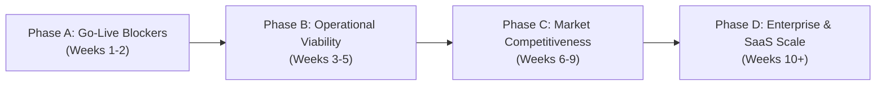

# Workflow Management System — Commercial Product Audit & Feature Roadmap

> **Document Version**: 1.0  
> **Date**: September 15, 2026  
> **Target Market**: B2B Mid-Market & Enterprise Workflow / Document Approval Automation  
> **Competitor Benchmark**: ServiceNow, Kissflow, Pipefy, Nintex, DocuSign CLM, Jira Service Management

---

## 1. Executive Summary

The Workflow Management System has established a solid architectural foundation: composite-foreign-key multi-tenancy, immutable version history, dual-format document handling (in-browser OnlyOffice `.docx` and Rich-Text editing), basic sequential approvals, and audit logging.

However, when evaluated against commercial enterprise requirements, the product currently operates as an **internal sequential document reviewer** rather than a **full-fledged commercial workflow automation platform**. 

To compete commercially, command 5-figure to 6-figure annual contracts (ACV), and win enterprise procurement bids, the platform must bridge gaps in:
1. **Time Governance & Accountability** (SLAs, Deadlines, Out-of-Office Delegation).
2. **Process Sophistication** (Parallel Sign-offs, Conditional Branching, Flexible Send-Back).
3. **Data & Document Intelligence** (Form Builder, E-Signatures, Version Redlining).
4. **Enterprise Identity & Operational Analytics** (SSO/SAML, Bottleneck BI, Complete Admin Oversight).

---

## 2. Current State: What Is Built & Working

| Capability | Current Status in Codebase | Notes |
| :--- | :--- | :--- |
| **Multi-Tenancy & Security** | Production Ready | Composite `(tenant_id, id)` FKs, Knex parameterized queries, bcrypt, JWT auth, role authorization. |
| **Stage Progression** | Functional (Strictly Linear) | Forward, Send-Back (strictly 1 stage backwards), Reject, Resubmit (clone-after-reject). |
| **Assignee Types** | Functional | User, Role, and Group-based assignments with stage claiming logic. |
| **Document Editing** | Dual Engine Functional | In-browser `.docx` editing via OnlyOffice DocumentServer; Rich-Text editor via HTML/Markdown. |
| **Workflow Types** | Functional | Predefined (admin-configured templates) and Ad-hoc (user-defined custom steps). |
| **Collaboration** | Functional | Ticket numbers (`DOC-2026-0001`), stage comments thread, and background SMTP email queue. |
| **User Dashboard** | Basic Functional | My Tasks view categorizing *Assigned to Me*, *Waiting on Others*, and *Completed*. |

---

## 3. Commercial Feature Gap Analysis

```
+---------------------------------------------------------------------------------------+
|                              COMMERCIAL FEATURE MATRIX                                |
+--------------------------+-----------------------------+------------------------------+
|  Tier 1: Deal-Breakers   |  Tier 2: Revenue Drivers    |  Tier 3: Enterprise & SaaS   |
|  (Cannot sell without)   |  (Enables 5x-10x Pricing)   |  (Large B2B Deals & Scale)   |
+--------------------------+-----------------------------+------------------------------+
| * SLA & Due Dates        | * Form / Metadata Builder   | * SSO / SAML / SCIM          |
| * Out of Office (OOO)    | * E-Signature & Certs       | * Bottleneck BI Dashboard    |
| * Parallel Approvals     | * Visual Document Diff      | * Webhooks & ERP / DMS Sync  |
| * Conditional Branching  | * Multi-File Attachments    | * White-labeling & Branding  |
| * Self-Service Pwd Reset | * 1-Click Email Approvals   | * Granular RBAC & Audit Dumps|
+--------------------------+-----------------------------+------------------------------+
```

### Tier 1: Commercial Deal-Breakers (Go-Live Blockers)
*Enterprises and corporate buyers will not deploy the software to business units without these capabilities.*

#### 1. SLA Tracking, Due Dates & Auto-Escalation
* **The Problem**: Businesses adopt workflow engines to prevent approvals from languishing in email black holes. Without deadlines or alerts, a $100k contract or PO can sit unattended indefinitely.
* **Commercial Solution**:
  * Configurable stage SLAs (e.g., "Must complete within 48 business hours").
  * Automated email reminders (e.g., 24 hours prior to deadline).
  * Visual UI status flags (`On Track`, `Due Soon`, `OVERDUE`).
  * Auto-escalation: Automatically reassign to a supervisor or escalate to department head if inactive past deadline.

#### 2. Out-of-Office (OOO) & Task Delegation
* **The Problem**: If a designated approver takes annual leave or falls ill, user-assigned stages freeze completely. Business operations stop until an IT admin manually intervenes in the database.
* **Commercial Solution**:
  * User profile self-service: *"Out of Office from Oct 1 to Oct 15; delegate all approval tasks to [Colleague]"*.
  * Automatic fallback routing if a task is unclaimed for longer than $N$ hours.

#### 3. Parallel Approvals & Multi-Signoff (Fork & Join)
* **The Problem**: In enterprise operations (procurement, hiring, legal), approvals must occur **concurrently** (e.g., Legal, Finance, and Security review at the same time). Forcing sequential review multiplies cycle time by $3\times$ or $4\times$.
* **Commercial Solution**:
  * Parallel stage split and join.
  * Configurable consensus rules:
    * **Unanimous (AND)**: All designated departments must approve before advancing.
    * **First Responder (OR)**: Any single reviewer's approval advances the workflow.
    * **Quorum / Majority**: E.g., at least 2 of 3 designated managers must approve.

#### 4. Conditional Logic & Dynamic Routing (Rules Engine)
* **The Problem**: Real-world approval paths depend on data:
  * *If Contract Amount $> \$50,000 \to$ Route to CFO; otherwise route to Team Manager.*
  * *If Document Category == "Confidential HR" $\to$ Require Legal Review stage.*
* **Commercial Solution**:
  * Rule builder based on document form values or stage responses (`IF field > value THEN goto Stage X ELSE goto Stage Y`).

#### 5. Self-Service Password Reset & Profile Management
* **The Problem**: Currently, passwords are created by admins or database seeds. No IT department will purchase software that generates IT helpdesk tickets for routine password resets.
* **Commercial Solution**:
  * Secure, expiring "Forgot Password" email link with single-use cryptographic token.
  * User profile settings page to update display name and password.

---

### Tier 2: High-Value Revenue Drivers (Enabling 5x–10x Higher ACV)
*Features that transform the product from a basic utility into an indispensable, high-margin platform.*

#### 6. Dynamic Form Builder & Document Metadata Generation
* **The Problem**: Users rarely initiate workflows with raw documents; they fill out structured request forms (e.g., *Vendor Name, Purchase Order Amount, Department, Target Date*).
* **Commercial Solution**:
  * No-code Form Builder per Document Type (Text, Dropdown, Date, Number, Currency, File).
  * Auto-fill template placeholders: System generates the `.docx` file by replacing tags (`{{Vendor_Name}}`, `{{Total_Amount}}`) with form values.
  * Search, sort, and filter workflows by form metadata.

#### 7. Legally-Binding E-Signatures & Audit Certificates
* **The Problem**: Clicking a "Forward" button is not an electronic signature under global legal frameworks (ESIGN, UETA, eIDAS). Companies pay separate subscriptions to DocuSign or PandaDoc to achieve legally enforceable sign-offs.
* **Commercial Solution**:
  * Dedicated e-signature stage: Draw, type, or upload signature.
  * Automatically append a tamper-evident **Completion Certificate PDF**: includes document SHA-256 hash, signer email, IP address, user agent, and verified timestamp.

#### 8. Document Version Diff & Visual Redlining
* **The Problem**: An approver at Stage 3 receiving Version 3 of a 30-page agreement has no automated way of knowing what Stage 2 changed. They must re-read the entire document or perform external manual comparisons.
* **Commercial Solution**:
  * In-app Visual Diff / Redline viewer displaying additions in green and deletions in red side-by-side between any two version snapshots.

#### 9. Multi-File Attachments & Supporting Evidence
* **The Problem**: Workflow approvals require supporting documentation (e.g., an invoice approval needs the supplier quote PDF, delivery note image, and tax exemption form). Currently, the system supports only a single primary document file.
* **Commercial Solution**:
  * Supporting attachments panel allowing multiple accompanying files (PDF, JPG, PNG, XLSX).

#### 10. One-Click Email Approvals ("Magic Links")
* **The Problem**: Senior executives and busy managers rarely log into internal portals to approve routine tasks.
* **Commercial Solution**:
  * Notification emails equipped with secure, single-use action tokens: users click `[Approve]` or `[Reject with Reason]` directly from their inbox on desktop or mobile.

---

### Tier 3: Enterprise Administration, Analytics & Governance
*Critical capabilities required to win enterprise RFPs, pass compliance audits, and scale within large organizations.*

#### 11. Operational BI & Bottleneck Analytics Dashboard
* **The Problem**: The admin instances screen (`AdminInstancesPage.tsx`) is currently an unbuilt stub (`<h1>All Instances</h1>`). Leadership buys workflow software to achieve operational transparency.
* **Commercial Solution**:
  * Complete Admin Instances View: Search by ticket number, filter by status, document type, date range, or assignee, and trigger admin reassignment.
  * Operational Heatmap: Identify pipeline bottlenecks (*"Legal Stage averages 4.8 days turnaround vs. Finance 0.9 days"*).
  * Compliance Audit Export: Export full audit logs and turnaround metrics to CSV, Excel, or PDF for regulatory audits (ISO 9001, SOC2, HIPAA).

#### 12. Flexible Stage Navigation ("Send Back to Stage X")
* **The Problem**: Currently, send-back is locked to exactly $N-1$ stages. If Stage 4 spots an error made at Stage 1, it must be laboriously stepped backwards through Stage 3 and Stage 2.
* **Commercial Solution**:
  * Reviewer can select any previous stage from a dropdown (*"Send back to Originator"* or *"Send back to Stage 2"*), accompanied by mandatory return notes.

#### 13. In-App Notification Center & Real-Time Alerts
* **The Problem**: Email is prone to spam filters, delays, and inbox clutter. Users lack an active in-app notification mechanism.
* **Commercial Solution**:
  * Header notification bell with unread badge counter.
  * Real-time push updates (via WebSockets or SSE) when an instance is assigned, returned, or commented on.
  * In-app `@mention` support in comments.

#### 14. Enterprise Identity & Single Sign-On (SSO)
* **The Problem**: Enterprise IT departments prohibit standalone credential silos and require centralized directory authentication.
* **Commercial Solution**:
  * SAML 2.0 / OIDC integrations (Microsoft Entra ID / Azure AD, Okta, Google Workspace).
  * SCIM 2.0 auto-provisioning to sync user onboarding and offboarding.

---

### Tier 4: SaaS Commercialization & Monetization
*Requirements for operating as a multi-tenant cloud SaaS offering with recurring subscription revenue.*

#### 15. White-Labeling & Tenant Custom Branding
* Upload tenant company logo.
* Configure brand color schemes across navigation and action buttons.
* Custom email sender domain and branded email templates.
* Vanity subdomains (`tenant.docuflow.com`).

#### 16. Tiered Licensing & Quota Management
* **Starter Tier**: 10 users, 5 predefined workflows, email notifications.
* **Professional Tier**: Unlimited workflows, OnlyOffice in-browser editing, form builder, SLA tracking.
* **Enterprise Tier**: SAML SSO, e-signatures, audit exports, custom branding, priority support, dedicated webhooks.

#### 17. Webhooks & Ecosystem Integration
* Outbound event webhooks (`workflow.started`, `stage.approved`, `workflow.completed`, `workflow.rejected`).
* Direct push to enterprise Document Management Systems (DocuMind DMS, SharePoint, Google Drive, AWS S3).
* Slack and Microsoft Teams notification and approval bots.

---

## 4. Feature Comparison: Current System vs. Commercial Market

| Feature Area | Current Workflow Engine | Commercial Competitors (Kissflow / Nintex / DocuSign) | Commercial Severity |
| :--- | :--- | :--- | :--- |
| **Workflow Routing** | Strictly linear sequential | Parallel split/join, conditional rules, arbitrary send-back | **High** |
| **Time Management** | None (tasks can sit forever) | SLAs, countdown timers, overdue warnings, auto-escalation | **Critical** |
| **Absence Handling** | Manual admin reassignment | Out-of-Office auto-delegation, fallback routing | **Critical** |
| **Input Capture** | Blank docx or rich-text editor | Drag-and-drop form builder, template variable binding | **High** |
| **Sign-Off Legality** | Basic forward button | E-signatures, biometric draw, audit certificates | **High** |
| **Version Review** | Full-text re-reading | Visual document diff / track changes redlining | **Medium** |
| **Admin Oversight** | Empty frontend stub | Global instance search, filter, reassignment, bottleneck BI | **Critical** |
| **User Notifications** | Background SMTP email only | In-app notification center, mobile push, 1-click email actions | **Medium** |
| **Identity & Security** | Local email/password only | SAML 2.0, Microsoft Azure AD / Entra ID, Okta, SCIM | **High** |
| **Group Hierarchy & Levels** | Flat groups (all members equal) | Multi-tier / Level-based assignment (L1 reviewer, L2 manager) | **High** |
| **Attachments** | Single file per instance | Multi-file supporting attachments (quotes, receipts, IDs) | **Medium** |

---

## 5. Phased Implementation Roadmap



### Phase A: Immediate Go-Live Readiness (Weeks 1–2)
* **Goal**: Fix operational dead ends and satisfy minimum viable IT requirements.
1. **Admin Instances Page**: Build out `AdminInstancesPage.tsx` with search, status/type filters, and instance reassignment controls.
2. **User Group Levels & Hierarchy**: Add tier/level support to groups (e.g. L1, L2) and stage configuration by group level.
3. **Self-Service Authentication**: Implement "Forgot Password" email flow and user profile password updates.
4. **Stage SLAs & Due Dates**: Add `due_at` / `sla_hours` to stages, calculate overdue states, and display visual warning badges.

### Phase B: Operational Viability (Weeks 3–5)
* **Goal**: Ensure workflows never freeze and provide day-to-day usability.
1. **Out-of-Office Delegation**: Allow users to set date-bounded delegation rules for pending and incoming tasks.
2. **Flexible Send-Back**: Enable reviewers to return an instance to any prior stage with mandatory justification notes.
3. **Multi-File Supporting Attachments**: Allow upload and viewing of secondary evidence files alongside the primary document.
4. **In-App Notification Center**: Add header bell icon with unread task counter.

### Phase C: Market Competitiveness & 5x ACV (Weeks 6–9)
* **Goal**: Deliver capabilities that justify premium pricing tiers.
1. **Parallel Approvals**: Implement fork/join stages supporting Unanimous (AND) and First-Responder (OR) consensus.
2. **Form Builder & Template Variables**: Structured form inputs that dynamically populate master document tags (`{{vendor}}`, `{{amount}}`).
3. **E-Signatures & Audit Certificate PDF**: Native signature capture and automated cryptographic sign-off certificates.
4. **Visual Document Diff**: Side-by-side version comparison highlighting additions and deletions.

### Phase D: Enterprise Scale & SaaS Commercialization (Weeks 10+)
* **Goal**: Win enterprise RFPs and enable self-service SaaS revenue.
1. **Enterprise SSO**: SAML 2.0 / OIDC integrations with Microsoft Azure AD / Entra ID and Okta.
2. **Operational BI & Analytics**: Stage bottleneck heatmaps, throughput reports, and CSV/Excel audit export.
3. **Tenant White-Labeling**: Custom tenant logos, theme colors, email branding, and custom subdomains.
4. **Webhooks & ChatOps**: Outbound webhooks and Slack / Microsoft Teams approval notifications.

